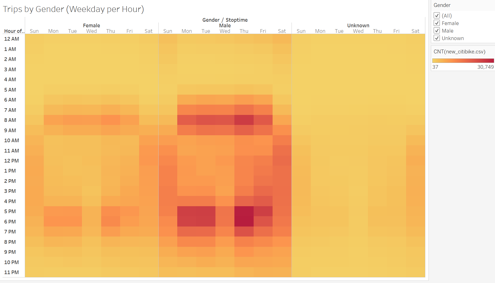
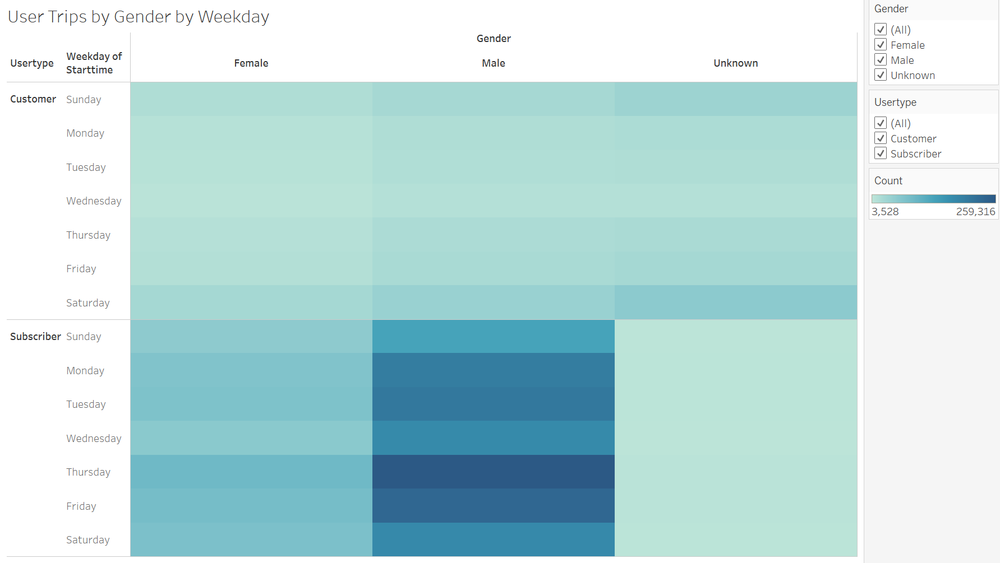

# bikesharing

## Overview: 
Use Tableau to analyze the bikeride data for New York. Tableau is a powerful tool for data presentation to tell the story to the audiance. 

## Result:

### Tableau Public Link
[View Results Here](https://public.tableau.com/app/profile/jackie.guo1187/viz/NYCCitibikeanalysis_16440962708290/NYCStory?publish=yes)

### Checkout Time by User
Most of the bike rides check less than an hour with most rides less than 10 minutes.

  

### Checkout Time by Gender
Majority of bikes are checked out by male.

  

### Trips by Weekday
The most rides are during the weekday communite hours

  

### Trips by Gender
Both Male and female uses the rides during the commute hours. Male has a much higher usage than female.

  

### Trips by Gender by UserType
Male Subscribers is the heavest user for the weekdays. 

  

### Top Starting Locations
Most bikes are checked out in the downtown area
  

## Summary

From the the analysis, it seems the majority of the users are male subscribers. And, the usage are during the commute hours during the week. 

Based on the usage, company can consider incentive programs during the none rush hours/weekend for more users.  

The make subscriber is 80%, it would be instresting to collect other facts/conduct survey to to see how to attract female subscribers. 